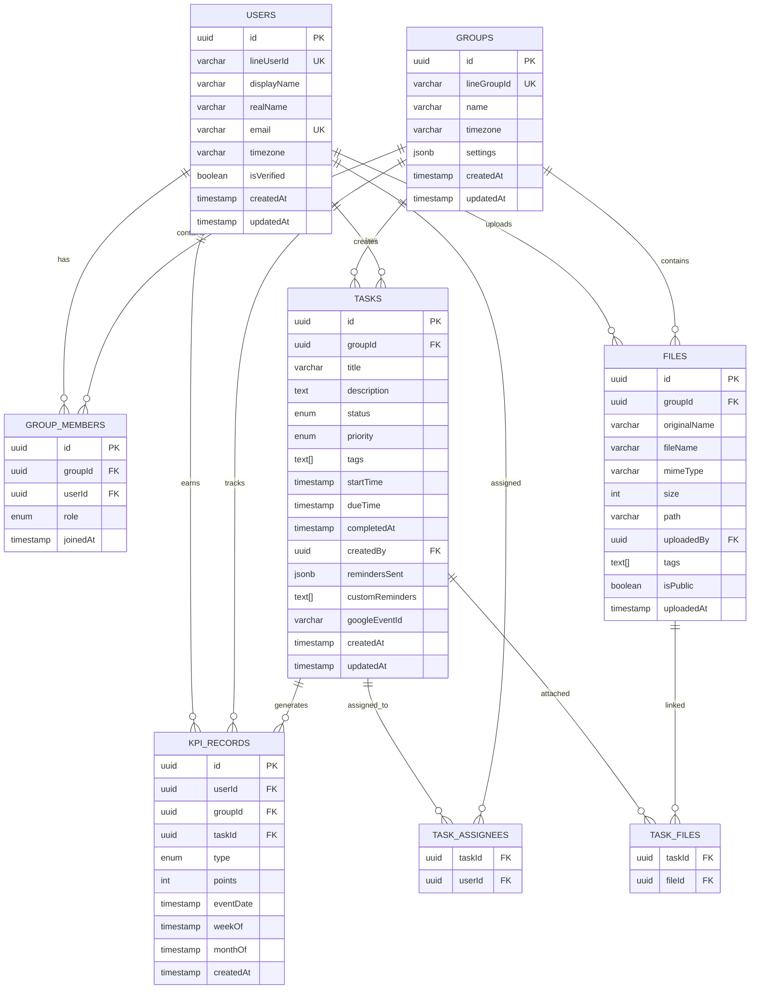

# 🗄️ Database Schema - โครงสร้างฐานข้อมูล

เอกสารโครงสร้างฐานข้อมูลครบถ้วนของเลขาบอท ใช้ PostgreSQL และ TypeORM

## 📋 ภาพรวม Database

### Database Engine
- **PostgreSQL** 12+
- **ORM:** TypeORM  
- **Language:** TypeScript
- **Migration:** TypeORM Auto-sync

### Database Tables
1. **users** - ข้อมูลผู้ใช้
2. **groups** - ข้อมูลกลุ่ม LINE
3. **group_members** - ความสัมพันธ์กลุ่ม-สมาชิก
4. **tasks** - ข้อมูลงาน
5. **files** - ข้อมูลไฟล์
6. **kpi_records** - บันทึก KPI และคะแนน
7. **task_assignees** - Junction table งาน-ผู้รับผิดชอบ
8. **task_files** - Junction table งาน-ไฟล์

## 🏗️ Entity Relationship Diagram (ERD)



## 📊 Table Details

### 1. users - ตารางผู้ใช้

เก็บข้อมูลผู้ใช้งานจาก LINE

```sql
CREATE TABLE users (
    id UUID PRIMARY KEY DEFAULT gen_random_uuid(),
    line_user_id VARCHAR NOT NULL UNIQUE,
    display_name VARCHAR NOT NULL,
    real_name VARCHAR,
    email VARCHAR UNIQUE,
    timezone VARCHAR DEFAULT 'Asia/Bangkok',
    is_verified BOOLEAN DEFAULT FALSE,
    created_at TIMESTAMP DEFAULT NOW(),
    updated_at TIMESTAMP DEFAULT NOW()
);
```

#### Columns
| Column | Type | Constraints | Description |
|--------|------|-------------|-------------|
| `id` | UUID | PRIMARY KEY | รหัสผู้ใช้ (Internal) |
| `line_user_id` | VARCHAR | UNIQUE, NOT NULL | รหัสผู้ใช้จาก LINE |
| `display_name` | VARCHAR | NOT NULL | ชื่อแสดงใน LINE |
| `real_name` | VARCHAR | NULLABLE | ชื่อจริง |
| `email` | VARCHAR | UNIQUE, NULLABLE | อีเมล |
| `timezone` | VARCHAR | DEFAULT 'Asia/Bangkok' | เขตเวลา |
| `is_verified` | BOOLEAN | DEFAULT FALSE | สถานะยืนยันตัวตน |
| `created_at` | TIMESTAMP | DEFAULT NOW() | วันที่สร้าง |
| `updated_at` | TIMESTAMP | DEFAULT NOW() | วันที่อัปเดต |

#### Relationships
- **1:N** → `group_members` (สมาชิกของกลุ่ม)
- **1:N** → `tasks` (งานที่สร้าง)
- **M:N** → `tasks` (งานที่รับผิดชอบ)
- **1:N** → `files` (ไฟล์ที่อัปโหลด)
- **1:N** → `kpi_records` (บันทึก KPI)

### 2. groups - ตารางกลุ่ม

เก็บข้อมูลกลุ่ม LINE

```sql
CREATE TABLE groups (
    id UUID PRIMARY KEY DEFAULT gen_random_uuid(),
    line_group_id VARCHAR NOT NULL UNIQUE,
    name VARCHAR NOT NULL,
    timezone VARCHAR DEFAULT 'Asia/Bangkok',
    settings JSONB DEFAULT '{}',
    created_at TIMESTAMP DEFAULT NOW(),
    updated_at TIMESTAMP DEFAULT NOW()
);
```

#### Columns
| Column | Type | Constraints | Description |
|--------|------|-------------|-------------|
| `id` | UUID | PRIMARY KEY | รหัสกลุ่ม (Internal) |
| `line_group_id` | VARCHAR | UNIQUE, NOT NULL | รหัสกลุ่มจาก LINE |
| `name` | VARCHAR | NOT NULL | ชื่อกลุ่ม |
| `timezone` | VARCHAR | DEFAULT 'Asia/Bangkok' | เขตเวลา |
| `settings` | JSONB | DEFAULT {} | การตั้งค่า |
| `created_at` | TIMESTAMP | DEFAULT NOW() | วันที่สร้าง |
| `updated_at` | TIMESTAMP | DEFAULT NOW() | วันที่อัปเดต |

#### Settings JSONB Structure
```json
{
  "reminderIntervals": ["P7D", "P1D", "PT3H"],
  "enableLeaderboard": true,
  "googleCalendarId": "calendar@group.calendar.google.com",
  "defaultReminders": ["P1D"],
  "workingHours": {
    "start": "09:00",
    "end": "18:00"
  }
}
```

#### Relationships
- **1:N** → `group_members` (สมาชิก)
- **1:N** → `tasks` (งานในกลุ่ม)
- **1:N** → `files` (ไฟล์ในกลุ่ม)
- **1:N** → `kpi_records` (บันทึก KPI)

### 3. group_members - ตารางสมาชิกกลุ่ม

เชื่อมความสัมพันธ์ระหว่างผู้ใช้กับกลุ่ม

```sql
CREATE TABLE group_members (
    id UUID PRIMARY KEY DEFAULT gen_random_uuid(),
    group_id UUID NOT NULL REFERENCES groups(id) ON DELETE CASCADE,
    user_id UUID NOT NULL REFERENCES users(id) ON DELETE CASCADE,
    role VARCHAR CHECK (role IN ('admin', 'member')) DEFAULT 'admin',
    joined_at TIMESTAMP DEFAULT NOW(),
    UNIQUE(group_id, user_id)
);
```

#### Columns
| Column | Type | Constraints | Description |
|--------|------|-------------|-------------|
| `id` | UUID | PRIMARY KEY | รหัสการเป็นสมาชิก |
| `group_id` | UUID | FK, NOT NULL | รหัสกลุ่ม |
| `user_id` | UUID | FK, NOT NULL | รหัสผู้ใช้ |
| `role` | ENUM | 'admin', 'member' | บทบาท |
| `joined_at` | TIMESTAMP | DEFAULT NOW() | วันที่เข้าร่วม |

#### Relationships
- **N:1** → `groups` (กลุ่ม)
- **N:1** → `users` (ผู้ใช้)

### 4. tasks - ตารางงาน

เก็บข้อมูลงานทั้งหมด

```sql
CREATE TABLE tasks (
    id UUID PRIMARY KEY DEFAULT gen_random_uuid(),
    group_id UUID NOT NULL REFERENCES groups(id) ON DELETE CASCADE,
    title VARCHAR NOT NULL,
    description TEXT,
    status VARCHAR CHECK (status IN ('pending', 'in_progress', 'completed', 'cancelled', 'overdue')) DEFAULT 'pending',
    priority VARCHAR CHECK (priority IN ('low', 'medium', 'high')) DEFAULT 'medium',
    tags TEXT[] DEFAULT '{}',
    start_time TIMESTAMP,
    due_time TIMESTAMP NOT NULL,
    completed_at TIMESTAMP,
    created_by UUID NOT NULL REFERENCES users(id),
    reminders_sent JSONB DEFAULT '[]',
    custom_reminders TEXT[] DEFAULT '{}',
    google_event_id VARCHAR,
    created_at TIMESTAMP DEFAULT NOW(),
    updated_at TIMESTAMP DEFAULT NOW()
);
```

#### Columns
| Column | Type | Constraints | Description |
|--------|------|-------------|-------------|
| `id` | UUID | PRIMARY KEY | รหัสงาน |
| `group_id` | UUID | FK, NOT NULL | รหัสกลุ่ม |
| `title` | VARCHAR | NOT NULL | ชื่องาน |
| `description` | TEXT | NULLABLE | รายละเอียด |
| `status` | ENUM | ใน 5 สถานะ | สถานะงาน |
| `priority` | ENUM | ใน 3 ระดับ | ความสำคัญ |
| `tags` | TEXT[] | DEFAULT {} | แท็ก |
| `start_time` | TIMESTAMP | NULLABLE | เวลาเริ่ม |
| `due_time` | TIMESTAMP | NOT NULL | เวลาครบกำหนด |
| `completed_at` | TIMESTAMP | NULLABLE | เวลาที่เสร็จ |
| `created_by` | UUID | FK, NOT NULL | ผู้สร้าง |
| `reminders_sent` | JSONB | DEFAULT [] | การแจ้งเตือนที่ส่งแล้ว |
| `custom_reminders` | TEXT[] | DEFAULT {} | การแจ้งเตือนกำหนดเอง |
| `google_event_id` | VARCHAR | NULLABLE | รหัส Google Calendar Event |
| `created_at` | TIMESTAMP | DEFAULT NOW() | วันที่สร้าง |
| `updated_at` | TIMESTAMP | DEFAULT NOW() | วันที่อัปเดต |

#### Status Values
- **pending** - รอดำเนินการ
- **in_progress** - กำลังดำเนินการ  
- **completed** - เสร็จสิ้น
- **cancelled** - ยกเลิก
- **overdue** - เกินกำหนด

#### Priority Values
- **low** - ความสำคัญต่ำ
- **medium** - ความสำคัญปานกลาง
- **high** - ความสำคัญสูง

#### Reminders Sent JSONB Structure
```json
[
  {
    "type": "P1D",
    "sentAt": "2023-01-01T10:00:00.000Z",
    "channels": ["line", "email"]
  }
]
```

#### Relationships
- **N:1** → `groups` (กลุ่ม)
- **N:1** → `users` (ผู้สร้าง)
- **M:N** → `users` (ผู้รับผิดชอบ)
- **M:N** → `files` (ไฟล์แนบ)
- **1:N** → `kpi_records` (บันทึก KPI)

### 5. files - ตารางไฟล์

เก็บข้อมูลไฟล์ที่อัปโหลด

```sql
CREATE TABLE files (
    id UUID PRIMARY KEY DEFAULT gen_random_uuid(),
    group_id UUID NOT NULL REFERENCES groups(id) ON DELETE CASCADE,
    original_name VARCHAR NOT NULL,
    file_name VARCHAR NOT NULL,
    mime_type VARCHAR NOT NULL,
    size INTEGER NOT NULL,
    path VARCHAR NOT NULL,
    uploaded_by UUID NOT NULL REFERENCES users(id),
    tags TEXT[] DEFAULT '{}',
    is_public BOOLEAN DEFAULT FALSE,
    uploaded_at TIMESTAMP DEFAULT NOW()
);
```

#### Columns
| Column | Type | Constraints | Description |
|--------|------|-------------|-------------|
| `id` | UUID | PRIMARY KEY | รหัสไฟล์ |
| `group_id` | UUID | FK, NOT NULL | รหัสกลุ่ม |
| `original_name` | VARCHAR | NOT NULL | ชื่อไฟล์เดิม |
| `file_name` | VARCHAR | NOT NULL | ชื่อไฟล์ในระบบ |
| `mime_type` | VARCHAR | NOT NULL | ประเภทไฟล์ |
| `size` | INTEGER | NOT NULL | ขนาดไฟล์ (bytes) |
| `path` | VARCHAR | NOT NULL | Path ไฟล์ |
| `uploaded_by` | UUID | FK, NOT NULL | ผู้อัปโหลด |
| `tags` | TEXT[] | DEFAULT {} | แท็ก |
| `is_public` | BOOLEAN | DEFAULT FALSE | เปิดเผยสาธารณะ |
| `uploaded_at` | TIMESTAMP | DEFAULT NOW() | วันที่อัปโหลด |

#### Relationships
- **N:1** → `groups` (กลุ่ม)
- **N:1** → `users` (ผู้อัปโหลด)
- **M:N** → `tasks` (งานที่เชื่อมโยง)

### 6. kpi_records - ตารางบันทึก KPI

เก็บคะแนนและสถิติการทำงาน

```sql
CREATE TABLE kpi_records (
    id UUID PRIMARY KEY DEFAULT gen_random_uuid(),
    user_id UUID NOT NULL REFERENCES users(id),
    group_id UUID NOT NULL REFERENCES groups(id),
    task_id UUID NOT NULL REFERENCES tasks(id),
    type VARCHAR CHECK (type IN ('early', 'ontime', 'late', 'overtime')) NOT NULL,
    points INTEGER NOT NULL,
    event_date TIMESTAMP NOT NULL,
    week_of TIMESTAMP NOT NULL,
    month_of TIMESTAMP NOT NULL,
    created_at TIMESTAMP DEFAULT NOW()
);
```

#### Columns
| Column | Type | Constraints | Description |
|--------|------|-------------|-------------|
| `id` | UUID | PRIMARY KEY | รหัสบันทึก |
| `user_id` | UUID | FK, NOT NULL | รหัสผู้ใช้ |
| `group_id` | UUID | FK, NOT NULL | รหัสกลุ่ม |
| `task_id` | UUID | FK, NOT NULL | รหัสงาน |
| `type` | ENUM | ใน 4 ประเภท | ประเภทการทำงาน |
| `points` | INTEGER | NOT NULL | คะแนนที่ได้ |
| `event_date` | TIMESTAMP | NOT NULL | วันที่เกิดเหตุการณ์ |
| `week_of` | TIMESTAMP | NOT NULL | สัปดาห์ที่ |
| `month_of` | TIMESTAMP | NOT NULL | เดือนที่ |
| `created_at` | TIMESTAMP | DEFAULT NOW() | วันที่บันทึก |

#### KPI Types และ Points
- **early** (+2 points) - เสร็จก่อนกำหนด ≥ 24 ชั่วโมง
- **ontime** (+1 point) - เสร็จตรงเวลา (±24 ชั่วโมง)
- **late** (-1 point) - ล่าช้า 24-48 ชั่วโมง  
- **overtime** (-2 points) - ค้างนาน > 48 ชั่วโมง

#### Relationships
- **N:1** → `users` (ผู้ใช้)
- **N:1** → `groups` (กลุ่ม)
- **N:1** → `tasks` (งาน)

### 7. task_assignees - Junction Table

เชื่อมความสัมพันธ์ M:N ระหว่างงานกับผู้รับผิดชอบ

```sql
CREATE TABLE task_assignees (
    task_id UUID NOT NULL REFERENCES tasks(id) ON DELETE CASCADE,
    user_id UUID NOT NULL REFERENCES users(id) ON DELETE CASCADE,
    PRIMARY KEY (task_id, user_id)
);
```

### 8. task_files - Junction Table

เชื่อมความสัมพันธ์ M:N ระหว่างงานกับไฟล์

```sql
CREATE TABLE task_files (
    task_id UUID NOT NULL REFERENCES tasks(id) ON DELETE CASCADE,
    file_id UUID NOT NULL REFERENCES files(id) ON DELETE CASCADE,
    PRIMARY KEY (task_id, file_id)
);
```

## 🔍 Indexes และ Performance

### Primary Indexes
```sql
-- Primary Keys (Auto-created)
CREATE UNIQUE INDEX users_pkey ON users(id);
CREATE UNIQUE INDEX groups_pkey ON groups(id);
CREATE UNIQUE INDEX tasks_pkey ON tasks(id);
CREATE UNIQUE INDEX files_pkey ON files(id);
CREATE UNIQUE INDEX kpi_records_pkey ON kpi_records(id);
```

### Unique Indexes
```sql
-- Unique constraints
CREATE UNIQUE INDEX users_line_user_id_key ON users(line_user_id);
CREATE UNIQUE INDEX users_email_key ON users(email);
CREATE UNIQUE INDEX groups_line_group_id_key ON groups(line_group_id);
CREATE UNIQUE INDEX group_members_group_user_key ON group_members(group_id, user_id);
```

### Performance Indexes
```sql
-- Query optimization indexes
CREATE INDEX tasks_group_id_idx ON tasks(group_id);
CREATE INDEX tasks_created_by_idx ON tasks(created_by);
CREATE INDEX tasks_status_idx ON tasks(status);
CREATE INDEX tasks_due_time_idx ON tasks(due_time);

CREATE INDEX files_group_id_idx ON files(group_id);
CREATE INDEX files_uploaded_by_idx ON files(uploaded_by);

CREATE INDEX kpi_records_user_id_idx ON kpi_records(user_id);
CREATE INDEX kpi_records_group_id_idx ON kpi_records(group_id);
CREATE INDEX kpi_records_week_of_idx ON kpi_records(week_of);
CREATE INDEX kpi_records_month_of_idx ON kpi_records(month_of);

-- Composite indexes for common queries
CREATE INDEX tasks_group_status_idx ON tasks(group_id, status);
CREATE INDEX kpi_records_user_month_idx ON kpi_records(user_id, month_of);
```

## 🔄 Database Migrations

### TypeORM Auto-sync
เลขาบอทใช้ TypeORM synchronization ในการจัดการ schema

```typescript
// src/utils/database.ts
export const AppDataSource = new DataSource({
  // ... connection config
  synchronize: true, // Auto-sync schema
  entities: [User, Group, GroupMember, Task, File, KPIRecord]
});
```

### Manual Migration (ถ้าต้องการ)
```sql
-- Create tables manually
\i scripts/create-tables.sql

-- Insert initial data
\i scripts/seed-data.sql
```

## 📊 Common Queries

### User และ Group Management

#### ดึงกลุ่มที่ผู้ใช้เป็นสมาชิก
```sql
SELECT g.*, gm.role, gm.joined_at
FROM groups g
JOIN group_members gm ON g.id = gm.group_id  
WHERE gm.user_id = $1
ORDER BY gm.joined_at DESC;
```

#### ดึงสมาชิกทั้งหมดในกลุ่ม
```sql
SELECT u.*, gm.role, gm.joined_at
FROM users u
JOIN group_members gm ON u.id = gm.user_id
WHERE gm.group_id = $1
ORDER BY gm.role, u.display_name;
```

### Task Management

#### ดึงงานที่ต้องทำวันนี้
```sql
SELECT t.*, u.display_name as creator_name
FROM tasks t
JOIN users u ON t.created_by = u.id
WHERE t.group_id = $1
  AND DATE(t.due_time) = CURRENT_DATE
  AND t.status IN ('pending', 'in_progress')
ORDER BY t.priority DESC, t.due_time ASC;
```

#### ดึงงานที่ผู้ใช้รับผิดชอบ
```sql
SELECT t.*, u.display_name as creator_name
FROM tasks t
JOIN task_assignees ta ON t.id = ta.task_id
JOIN users u ON t.created_by = u.id
WHERE ta.user_id = $1
  AND t.status NOT IN ('completed', 'cancelled')
ORDER BY t.due_time ASC;
```

#### ดึงงานที่เกินกำหนด
```sql
SELECT t.*, u.display_name as creator_name
FROM tasks t
JOIN users u ON t.created_by = u.id
WHERE t.group_id = $1
  AND t.due_time < NOW()
  AND t.status NOT IN ('completed', 'cancelled')
ORDER BY t.due_time ASC;
```

### KPI และ Leaderboard

#### คำนวณคะแนนรายเดือน
```sql
SELECT 
  u.id,
  u.display_name,
  SUM(k.points) as total_points,
  COUNT(k.task_id) as tasks_completed,
  AVG(k.points) as avg_score
FROM users u
JOIN kpi_records k ON u.id = k.user_id
WHERE k.group_id = $1
  AND k.month_of = DATE_TRUNC('month', $2)
GROUP BY u.id, u.display_name
ORDER BY total_points DESC;
```

#### สถิติกลุ่มรายเดือน
```sql
SELECT 
  COUNT(DISTINCT k.user_id) as active_members,
  COUNT(k.task_id) as total_tasks,
  SUM(k.points) as total_points,
  AVG(k.points) as avg_score,
  COUNT(CASE WHEN k.type = 'early' THEN 1 END) as early_tasks,
  COUNT(CASE WHEN k.type = 'ontime' THEN 1 END) as ontime_tasks,
  COUNT(CASE WHEN k.type = 'late' THEN 1 END) as late_tasks,
  COUNT(CASE WHEN k.type = 'overtime' THEN 1 END) as overtime_tasks
FROM kpi_records k
WHERE k.group_id = $1
  AND k.month_of = DATE_TRUNC('month', $2);
```

### File Management

#### ดึงไฟล์ล่าสุดในกลุ่ม
```sql
SELECT f.*, u.display_name as uploader_name
FROM files f
JOIN users u ON f.uploaded_by = u.id
WHERE f.group_id = $1
ORDER BY f.uploaded_at DESC
LIMIT 10;
```

#### ค้นหาไฟล์ตามชื่อและแท็ก
```sql
SELECT f.*, u.display_name as uploader_name
FROM files f
JOIN users u ON f.uploaded_by = u.id
WHERE f.group_id = $1
  AND (
    f.original_name ILIKE '%' || $2 || '%'
    OR $2 = ANY(f.tags)
  )
ORDER BY f.uploaded_at DESC;
```

## 🗂️ Data Types และ Constraints

### UUID Generation
```sql
-- PostgreSQL 13+
CREATE EXTENSION IF NOT EXISTS "pgcrypto";
-- ใช้ gen_random_uuid() สำหรับ UUID generation
```

### JSONB Usage
```sql
-- การใช้ JSONB ใน settings และ reminders_sent
-- Supports indexing และ querying
CREATE INDEX groups_settings_gin ON groups USING GIN (settings);
```

### Array Types
```sql
-- TEXT[] สำหรับ tags และ custom_reminders
-- รองรับ array operations
SELECT * FROM tasks WHERE 'urgent' = ANY(tags);
```

### Timestamp Handling
```sql
-- ใช้ TIMESTAMP WITH TIME ZONE ใน production
-- TypeORM จัดการ timezone อัตโนมัติ
```

## 🔒 Security และ Permissions

### Row Level Security (RLS)
```sql
-- เปิดใช้งาน RLS สำหรับ multi-tenancy
ALTER TABLE tasks ENABLE ROW LEVEL SECURITY;

-- Policy สำหรับแต่ละกลุ่ม
CREATE POLICY group_isolation ON tasks
  USING (group_id IN (
    SELECT group_id FROM group_members 
    WHERE user_id = current_user_id()
  ));
```

### Data Validation
- Email format validation
- File size limits (10MB)
- File type restrictions
- UUID format validation

## 📈 Backup และ Maintenance

### Backup Strategy
```bash
# Daily backup
pg_dump -h localhost -U postgres leka_bot > backup_$(date +%Y%m%d).sql

# Restore backup
psql -h localhost -U postgres leka_bot < backup_20231201.sql
```

### Index Maintenance
```sql
-- Re-index ประจำสัปดาห์
REINDEX DATABASE leka_bot;

-- Analyze tables สำหรับ query planner
ANALYZE;
```

### Cleanup Tasks
```sql
-- ลบ KPI records เก่า (เก็บไว้ 2 ปี)
DELETE FROM kpi_records 
WHERE created_at < NOW() - INTERVAL '2 years';

-- ลบไฟล์ที่ไม่ได้ใช้
DELETE FROM files 
WHERE uploaded_at < NOW() - INTERVAL '1 year'
  AND id NOT IN (SELECT file_id FROM task_files);
```

## 🔧 Database Configuration

### PostgreSQL Settings
```conf
# postgresql.conf optimizations
shared_buffers = 256MB
work_mem = 4MB
maintenance_work_mem = 64MB
effective_cache_size = 1GB
random_page_cost = 1.1
```

### Connection Pooling
```typescript
// TypeORM connection pool
{
  type: 'postgres',
  extra: {
    max: 20,        // max connections
    min: 5,         // min connections
    idle: 10000,    // idle timeout
    acquire: 60000, // acquire timeout
  }
}
```

## 📞 Support

หากมีปัญหาเกี่ยวกับ database:

1. ตรวจสอบ [Troubleshooting Guide](./TROUBLESHOOTING.md)
2. รัน database test: `npm run db:test`
3. ตรวจสอบ logs: `railway logs` (สำหรับ Railway)
4. สร้าง [GitHub Issue](https://github.com/yourusername/leka-bot/issues)

---

**Database Version:** PostgreSQL 12+  
**ORM Version:** TypeORM 0.3+  
**Last Updated:** January 2024