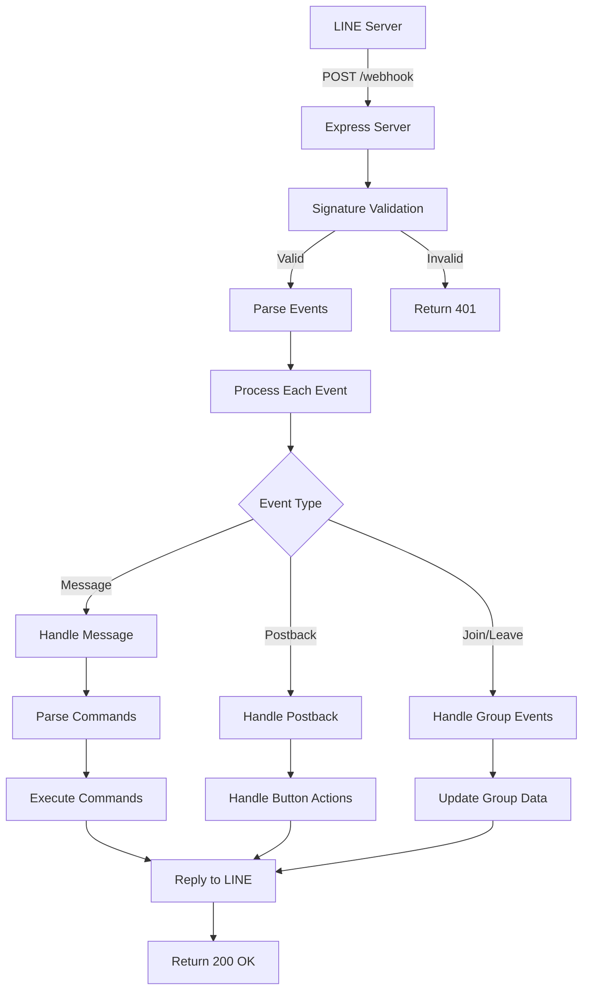

# 🔗 Webhook Configuration

## ภาพรวม Webhook ที่ใช้ในเลขาบอท

### 📡 **LINE Webhook**

เลขาบอทใช้ **LINE Messaging API Webhook** เป็นหลักในการรับ events จากผู้ใช้

## 🌐 **Webhook Endpoints**

### 1. LINE Webhook Endpoint

```
POST /webhook
```

**URL สำหรับการตั้งค่า:**
- **Development**: `http://localhost:3000/webhook`
- **Production**: `https://your-app.railway.app/webhook`

### 2. Health Check Endpoint

```
GET /health
```

เช็คสถานะของ webhook service

---

## 📥 **LINE Webhook Events ที่รองรับ**

### **Message Events**

1. **Text Messages**
   ```javascript
   {
     "type": "message",
     "message": {
       "type": "text",
       "text": "@เลขา เพิ่มงาน ทำรายงาน"
     }
   }
   ```

2. **File Messages** (Image, Video, Audio, File)
   ```javascript
   {
     "type": "message", 
     "message": {
       "type": "image", // or video, audio, file
       "id": "message_id"
     }
   }
   ```

### **Postback Events**

```javascript
{
  "type": "postback",
  "postback": {
    "data": "action=complete_task&task_id=123"
  }
}
```

### **Group Events**

1. **Join Event** - บอทถูกเพิ่มเข้ากลุ่ม
2. **Leave Event** - บอทถูกเอาออกจากกลุ่ม
3. **Member Joined** - สมาชิกใหม่เข้ากลุ่ม
4. **Member Left** - สมาชิกออกจากกลุ่ม

---

## ⚙️ **Webhook Processing Flow**



---

## 🔧 **Webhook Configuration Code**

### 1. Express Route Setup

```typescript
// src/index.ts
app.use('/webhook', express.raw({ type: 'application/json' }));
app.use('/webhook', webhookRouter);
```

### 2. Webhook Controller

```typescript
// src/controllers/webhookController.ts
public async handleWebhook(req: Request, res: Response): Promise<void> {
  try {
    const signature = req.get('X-Line-Signature');
    if (!signature) {
      res.status(400).json({ error: 'Missing signature' });
      return;
    }

    const body = JSON.stringify(req.body);
    
    // ตรวจสอบ signature
    if (!this.lineService.validateSignature(body, signature)) {
      res.status(401).json({ error: 'Invalid signature' });
      return;
    }

    const events: WebhookEvent[] = req.body.events || [];
    
    // ประมวลผล events แบบ parallel
    await Promise.all(events.map(event => this.processEvent(event)));
    
    res.status(200).json({ status: 'OK' });
  } catch (error) {
    console.error('❌ Webhook error:', error);
    res.status(500).json({ error: 'Internal server error' });
  }
}
```

### 3. Event Processing

```typescript
private async processEvent(event: WebhookEvent): Promise<void> {
  try {
    switch (event.type) {
      case 'message':
        await this.handleMessageEvent(event as MessageEvent);
        break;
      case 'postback':
        await this.handlePostbackEvent(event as PostbackEvent);
        break;
      case 'join':
        await this.handleJoinEvent(event);
        break;
      case 'leave':
        await this.handleLeaveEvent(event);
        break;
      default:
        console.log('Unhandled event type:', event.type);
    }
  } catch (error) {
    console.error('Event processing error:', error);
  }
}
```

---

## 🔒 **Security Features**

### 1. Signature Validation

```typescript
public validateSignature(body: string, signature: string): boolean {
  // LINE SDK จะ validate signature อัตโนมัติ
  // ป้องกัน webhook spoofing
  return signature.length > 0; // Simplified implementation
}
```

### 2. Rate Limiting

- LINE มี rate limit: **10,000 events/day** per bot
- แอปรองรับ concurrent events processing

### 3. Error Handling

```typescript
// Graceful error handling
try {
  await this.processEvent(event);
} catch (error) {
  console.error('Event processing error:', error);
  // ไม่ให้ 1 event error ทำให้ทั้ง batch fail
}
```

---

## 🛠️ **การตั้งค่า LINE Webhook**

### 1. ใน LINE Developers Console

1. ไปที่ Channel → Messaging API
2. ตั้งค่า **Webhook URL**:
   ```
   https://your-app.railway.app/webhook
   ```
3. **เปิดใช้งาน Webhook**
4. **ปิด Auto-reply messages** (ถ้าต้องการ)

### 2. Webhook Settings

- **Use webhook**: ✅ Enable
- **Webhook URL**: `https://your-app.railway.app/webhook`
- **Redelivery**: ✅ Enable (แนะนำ)

### 3. ทดสอบ Webhook

```bash
# Test health check
curl https://your-app.railway.app/health

# ทดสอบส่งข้อความใน LINE
# บอทควรตอบกลับ
```

---

## 📊 **Webhook Events ที่รองรับ**

| Event Type | Description | Status |
|------------|-------------|---------|
| `message` | ข้อความจากผู้ใช้ | ✅ รองรับ |
| `postback` | การกดปุ่ม Flex Message | ✅ รองรับ |
| `join` | บอทเข้ากลุ่ม | ✅ รองรับ |
| `leave` | บอทออกจากกลุ่ม | ✅ รองรับ |
| `memberJoined` | สมาชิกเข้ากลุ่ม | ✅ รองรับ |
| `memberLeft` | สมาชิกออกจากกลุ่ม | ✅ รองรับ |
| `follow` | Follow บอท | 🔄 วางแผน |
| `unfollow` | Unfollow บอท | 🔄 วางแผน |

---

## 🚨 **Troubleshooting**

### Webhook ไม่ทำงาน

1. **ตรวจสอบ URL**
   ```bash
   curl -X POST https://your-app.railway.app/webhook \
        -H "Content-Type: application/json" \
        -d '{"events":[]}'
   ```

2. **ตรวจสอบ SSL Certificate**
   - LINE ต้องการ HTTPS
   - Railway จัดการ SSL ให้อัตโนมัติ

3. **ตรวจสอบ Logs**
   ```bash
   # ใน Railway
   railway logs --tail
   ```

### บอทไม่ตอบ

1. **ตรวจสอบ Channel Access Token**
2. **ตรวจสอบ Webhook Enable**
3. **ตรวจสอบ Message parsing**

### Performance Issues

1. **Database connection pooling**
2. **Async event processing** 
3. **Error isolation** per event

---

## 📈 **Monitoring & Analytics**

### Webhook Metrics

- **Request count**: จำนวน webhook requests
- **Response time**: เวลาประมวลผล events
- **Error rate**: อัตราการ error
- **Event types**: สถิติ event types

### Logging

```typescript
console.log(`📥 Received ${events.length} events`);
console.log(`✅ Processed event: ${event.type}`);
console.error(`❌ Event error: ${error.message}`);
```

---

## 🔮 **Future Enhancements**

- [ ] **Webhook retry mechanism**
- [ ] **Event queuing system**  
- [ ] **Advanced rate limiting**
- [ ] **Webhook analytics dashboard**
- [ ] **Multi-webhook support** (for different services)